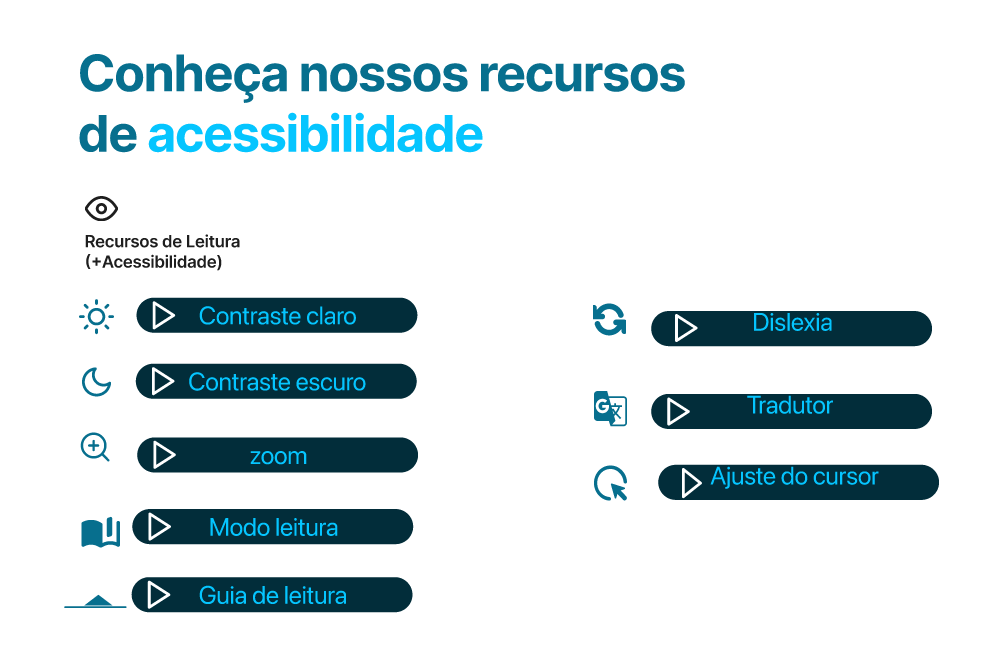

# Acessibilidade Já

**Código da Disciplina**: FGA0208 
**Número do Grupo**: 04 
**Entrega**: 01 

## Equipe

<table>
  <tr>
    <td align="center"><a href="https://github.com/Felipe-Brandim"> <b>Felipe Brandim</b></a> 
    <td align="center"><a href="https://github.com/daramariabs"> <b>Dara Maria</b></a>    
   <td align="center"><a href="https://github.com/pfc15"> <b>Pedro Cruz</b></a> 
    <td align="center"><a href="https://github.com/Fernandavazgit1 "> <b>Fernanda Vaz</b></a> 
    <td align="center"><a href="https://github.com/mrodrigues14 "> <b>Matheus Rodrigues</b></
    a> 
    <td align="center"><a href="https://github.com/lucasbbranco"> <b>Lucas Branco</b></a> 
    <td align="center"><a href="https://github.com/enzo-fb"> <b>Enzo Fernandes</b></a>    
    <td align="center"><a href="https://github.com/fabiofonteles1 "> <b>Fábio Fonteles</b></a> 
    <td align="center"><a href="https://github.com/isaacbatista26 "> <b>Isaac Batista</b></a> 
    <td align="center"><a href="https://github.com/JoosPerro "> <b>João Pedro</b></a> 
    
  </tr>
</table>

## Sobre

Queremos por meio desse projeto trazer uma solução open source para problemas de acessibilidade em aplicações web.

A intenção é criar widgets de acessibilidade que possam ser facilmente utilizados em sites diversos, ficando a critério do desenvolvedor a escolha da nossa ferramenta. Uma vez que ele a escolhe e a implementa no código, os usuários poderão usufruir livremente de seus benefícios;contribuindo dessa forma para um mundo digital um pouco mais acessível.

## Exemplos da Segunda Entrega

Protótipo Alta Fidelidade:

  

## Passo a passo para executar nossa aplicação:

Por enquanto só temos o pages pronto, para visualizar localmente o comando é:

`mkdocs serve`

## Para desenvolvimento:

Foi adicionado uma estrutura inicial para que possamos começar o desenvolvimento da nossa ferramenta, com essa estrutura temos um front-end em javascript utilizando Node, next e react, e um backend com postgres SQL.

Tudo quanto é necessário para visualizar a aplicação e começar a editar, é:

1- clonar o repositório
2- Abrir a pasta clonada na sua IDE de preferência
3- Digitar no terminal o comando `npm install`.
4- Digitar no terminal o comando `npm run dev`.

Ou

Abrir um codespaces e digitar no terminal o comando:
1- `npm install`.
2- `npm run dev`.

## Licença

Este projeto é **open source** e está licenciado sob a Licença MIT.
