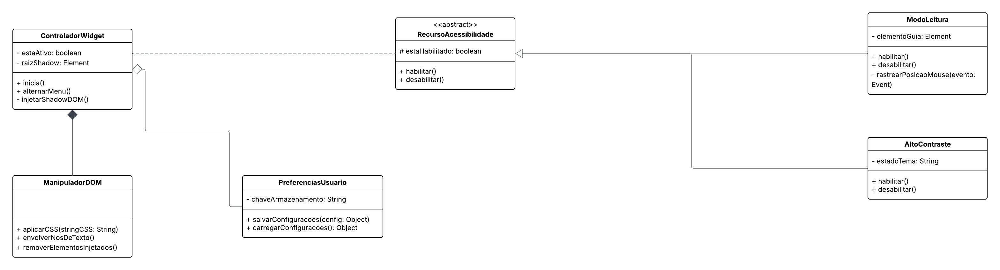

# 2.1. Módulo Notação UML – Modelagem Estática

## Diagrama de Classes

Para garantir a escalabilidade e o isolamento técnico do nosso widget em relação aos sites hospedeiros, a estrutura do código foi modelada utilizando os princípios de Orientação a Objetos.

O diagrama de classes abaixo ilustra o esqueleto do sistema, destacando:

* O padrão de **Composição** e **Agregação** gerenciado pelo `ControladorWidget`.
* A blindagem do código através do `ManipuladorDOM`, responsável exclusivo pelas injeções de estilo.
* A utilização de **Herança** a partir da classe abstrata `RecursoAcessibilidade`, permitindo que novas funcionalidades (como ajustes de fonte ou filtros de daltonismo) sejam adicionadas no futuro sem alterar o controlador principal.

### Visão Estrutural

_Autoria: Dara Maria_  

---

## Diagrama de Componentes

O diagrama de componentes é um tipo de diagrama da UML utilizado para representar a estrutura estática de um sistema, evidenciando seus componentes, as interfaces fornecidas e requeridas, as portas e os relacionamentos entre esses elementos.

Esse tipo de diagrama é amplamente utilizado no contexto do Desenvolvimento Baseado em Componentes (CBD) e na modelagem de sistemas com Arquitetura Orientada a Serviços (SOA), pois permite visualizar como diferentes partes do sistema interagem de forma modular.

_Autoria: Fernanda vaz_  
_Ajustes/Revisão: Enzo Fernandes_

## Histórico de versões

| Versão | Data       | Descrição                                               | Autor(es)                                           |
| :----: | :--------- | :------------------------------------------------------ | :-------------------------------------------------- |
| `1.0`  | 14/04/2026 | Criação da página                                       | [Felipe Brandim](https://github.com/Felipe-Brandim) |
| `1.1`  | 19/04/2026 | Adição do diagrama de componentes inicial               | [Fernanda vaz ](https://github.com/Felipe-Brandim)  |
| `1.2`  | 20/04/2026 | Ajuste do diagrama de componentes - Autora Fernanda Vaz | [Enzo Fernandes](https://github.com/enzo-fb)        |
| `1.3`  | 20/04/2026 | Adição do digrama de Classes | [Dara Maria ](https://github.com/daramariabs)        |
