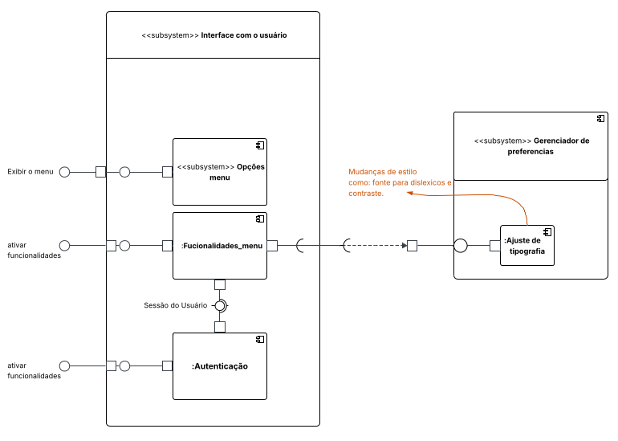
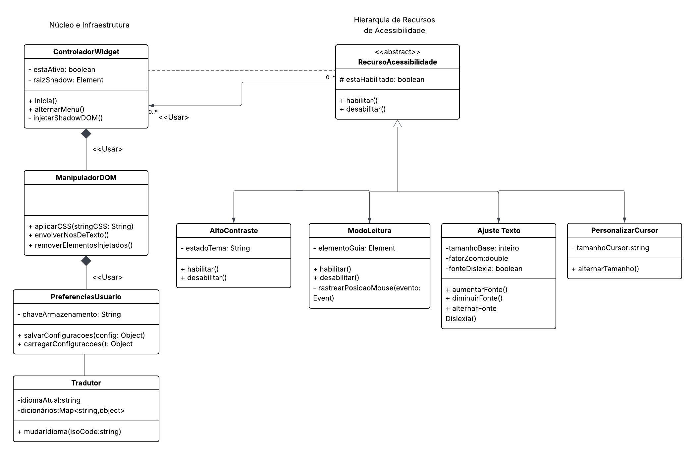

# 2.1. Módulo Notação UML – Modelagem Estática

Foco_1: Modelagem UML Estática.

Entrega Mínima: 1 Modelo Estático (ESCOPO: Diagrama de Classes; Diagrama de Componentes ou Diagrama de Implantação).

Apresentação (para a professora) explicando o modelo estático especificado, com: (i) rastro claro aos membros participantes (MOSTRAR QUADRO DE PARTICIPAÇÕES & COMMITS); (ii) justificativas & senso crítico sobre o modelo, e (iii) comentários gerais sobre o trabalho em equipe. Tempo da Apresentação: +/- 5min. Recomendação: Apresentar diretamente via Wiki ou GitPages do Projeto. Baixar os conteúdos com antecedência, evitando problemas de internet no momento de exposição nas Dinâmicas de Avaliação.

A Wiki ou GitPages do Projeto deve conter um tópico dedicado ao Módulo Modelagem Estática (Notação UML), com 1 modelo, histórico de versões, referências, e demais detalhamentos gerados pela equipe nesse escopo.

## Diagrama de Componentes

O diagrama de componentes é um tipo de diagrama da UML utilizado para representar a estrutura estática de um sistema, evidenciando seus componentes, as interfaces fornecidas e requeridas, as portas e os relacionamentos entre esses elementos.

Esse tipo de diagrama é amplamente utilizado no contexto do Desenvolvimento Baseado em Componentes (CBD) e na modelagem de sistemas com Arquitetura Orientada a Serviços (SOA), pois permite visualizar como diferentes partes do sistema interagem de forma modular.

_Autoria: Fernanda vaz_  
_Ajuste: Enzo Fernandes_

_Autoria: Fernanda vaz_  

## Diagrama de Classes

Um diagrama de classes UML representa a estrutura de um sistema orientado a objetos, mostrando suas classes, atributos, métodos e os relacionamentos entre elas. Ele é utilizado para visualizar e organizar os elementos do sistema de forma clara antes da implementação.

Abaixo temos a elaboração do diagrama de classes que representa o funcionamento do nosso sistema e suas futuras ferramentas:

_Autoria: Dara Maria e Felipe Brandim_  

## Histórico de versões

| Versão | Data       | Descrição                                                                      | Autor(es)                                           |
| :----: | :--------- | :----------------------------------------------------------------------------- | :-------------------------------------------------- |
| `1.0`  | 14/04/2026 | Criação da página                                                              | [Felipe Brandim](https://github.com/Felipe-Brandim) |
| `1.1`  | 19/04/2026 | Adição do diagrama de componentes inicial                                      | [Fernanda vaz ](https://github.com/Fernandavazgit1) |
| `1.2`  | 20/04/2026 | Ajuste do diagrama de componentes - Autora Fernanda Vaz                        | [Enzo Fernandes](https://github.com/enzo-fb)        |
| `1.3`  | 20/04/2026 | Criação do primeiro diagrama de classes                                        | [Dara Maria](https://github.com/daramariabs)        |
| `1.4`  | 20/04/2026 | Atualização do diagrama de classes/correção do segundo diagrama de componentes | [Felipe Brandim](https://github.com/Felipe-Brandim) |
