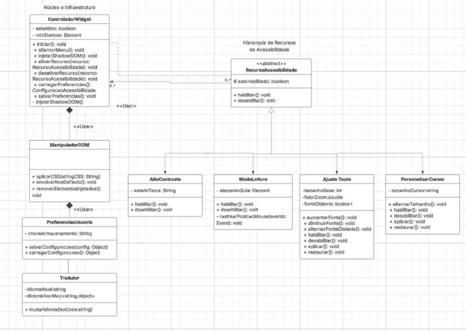
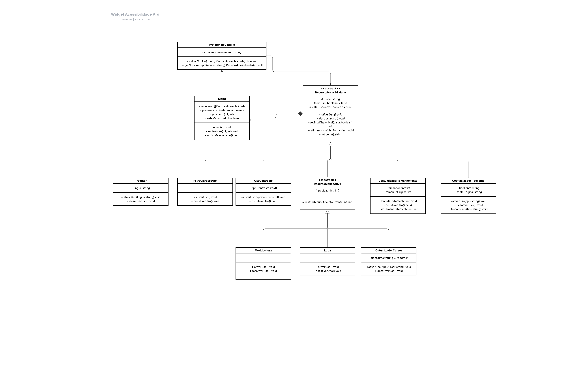
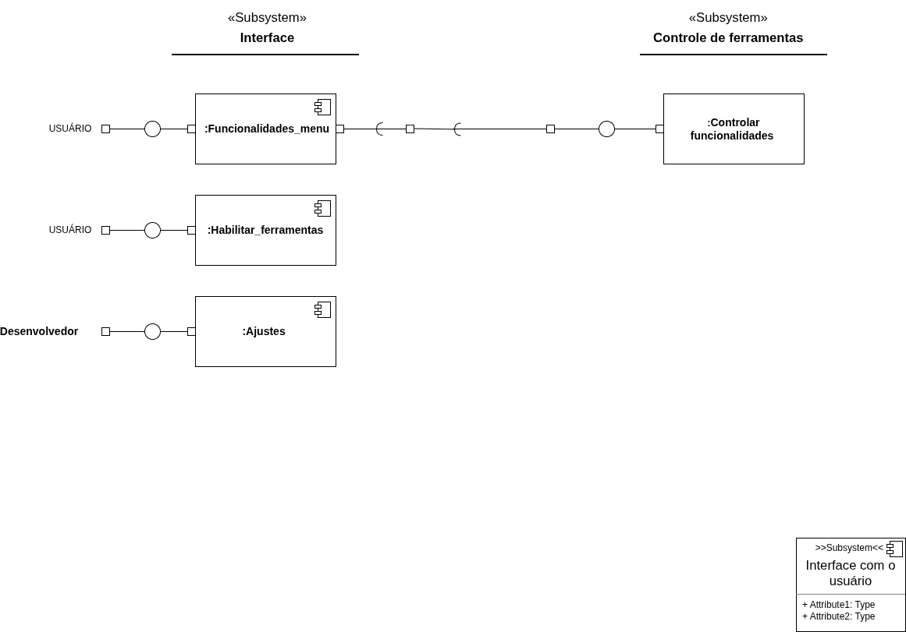
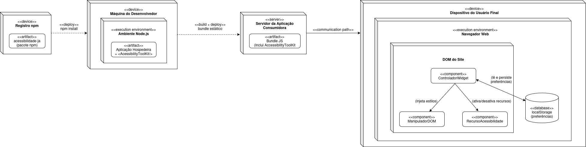

# 2.1. Módulo Notação UML – Modelagem Estática

## Diagrama de Classes

Para garantir a escalabilidade e o isolamento técnico do nosso widget em relação aos sites hospedeiros, a estrutura do código foi modelada utilizando os princípios de Orientação a Objetos.

O diagrama de classes abaixo ilustra o esqueleto do sistema, destacando além de outras abstrações e ferramentas pretendidas:

- O padrão de **Composição** e **Agregação** gerenciado pelo `ControladorWidget`.
- A blindagem do código através do `ManipuladorDOM`, responsável exclusivo pelas injeções de estilo.
- A utilização de **Herança** a partir da classe abstrata `RecursoAcessibilidade`, permitindo que novas funcionalidades (como ajustes de fonte ou filtros de daltonismo) sejam adicionadas no futuro sem alterar o controlador principal.

_Autoria: Dara Maria , Felipe Brandim_ e Fábio Araújo  
link com explicação de diagrama de classes: (https://medium.com/@phjb/diagrama-de-classes-o-filho-famoso-da-uml-e333027e33e0)

Foi feita uma segunda modelagem baseado na de cima repensando a parte de núcleo e infraestrutura e adicionando mais funcionalidades. A proposta é deixar mais robusta as implementações das classes filhas de Recursos de  acessibilidade, principalmente aitvarUso() e desativarUso(). E então abrir mão da classe ManipulardorDOM pois toda a manipulação de DOM aconteceria dentro das classes Recursos. Também foi adicionado uma classe menu para juntar todos os objetos dos filhos de RecursoAcessibilidade. Aleḿ de outras mudanças mudanças menores, como realocação de Tradutor para filho de RecursoAcessibilidade entre outros.

Acredito que essas mudanças podem melhorar a implementação e arquitetura do projeto. Como não houve tempo para discussão e é uma mudança relativamente significativa do projeto. Principalemente pelo proposta de retirada do ManipuladorDOM e ControladorWidget. Mantenho o diagrama apenas como uma proposta. Mas acredito que, independente da escolha, as mudanças de Menu, PreferenciaUsuario, RecursoMouseAtivo e entre outras devem ser mantidas. 

*Autoria Pedro Cruz*

## Diagrama de Componentes

O diagrama de componentes é um tipo de diagrama da UML utilizado para representar a estrutura estática de um sistema, evidenciando seus componentes, as interfaces fornecidas e requeridas, as portas e os relacionamentos entre esses elementos.

Esse tipo de diagrama é amplamente utilizado no contexto do Desenvolvimento Baseado em Componentes (CBD) e na modelagem de sistemas com Arquitetura Orientada a Serviços (SOA), pois permite visualizar como diferentes partes do sistema interagem de forma modular.

No contexto do **AcessibilidadeJá**, o diagrama evidencia a separação entre a aplicação hospedeira e o núcleo do widget, deixando explícito que a integração ocorre por contrato (interface pública) e não por acoplamento direto de implementação. Isso facilita tanto a manutenção quanto a evolução incremental da solução.

De forma geral, os componentes representados cumprem os seguintes papéis:

1. **Aplicação Hospedeira**: consome o componente principal do widget e dispara sua inicialização no ciclo de vida da página.
2. **ControladorWidget**: funciona como ponto central de orquestração, recebendo eventos da interface, delegando ações aos recursos e coordenando persistência de preferências.
3. **RecursoAcessibilidade**: encapsula cada funcionalidade específica (como contraste, escala de fonte e ajustes visuais), permitindo extensão sem alterar o controlador.
4. **ManipuladorDOM**: concentra todas as alterações no DOM e a injeção de estilos, preservando o isolamento técnico do widget em relação ao restante do site.
5. **Persistência Local**: registra preferências do usuário para reaplicação automática em sessões futuras, garantindo continuidade de uso.

As dependências mostradas no diagrama também reforçam decisões arquiteturais importantes:

- **Baixo acoplamento** entre interface pública e implementação interna.
- **Alta coesão** dos componentes internos, cada um com responsabilidade bem delimitada.
- **Extensibilidade** por adição de novos recursos sem quebra de contratos existentes.
- **Portabilidade** da solução, já que a execução é client-side e independe de backend dedicado.

Assim, o diagrama de componentes complementa os demais artefatos de modelagem ao mostrar, em nível arquitetural, como o sistema é particionado e como os blocos colaboram entre si para entregar acessibilidade de forma modular e reutilizável.

_Autoria: Fernanda vaz_  
_Ajuste: Enzo Fernandes_

_Autoria: Fernanda vaz_  
>Versão inicial

---

Versão interativa do diagrama no Mermaid: [abrir diagrama](https://mermaid.ai/d/4db46faf-1804-49e4-a2d7-2fd9e24a5b90)

_Autoria: Lucas Branco_

## Diagrama de Implantação

O diagrama de implantação descreve como os artefatos do sistema são distribuídos entre os nós físicos e de execução, evidenciando o fluxo desde o desenvolvimento até a execução no ambiente do usuário final.

O ciclo de vida da ferramenta **AcessibilidadeJá** passa por quatro estágios principais:

1. **Registro npm** — O pacote `acessibilidade-ja` é publicado no registro npm e disponibilizado para instalação via `npm install`. Esse é o ponto de entrada para qualquer desenvolvedor que deseje integrar a ferramenta.

2. **Máquina do Desenvolvedor** — No ambiente Node.js local, o desenvolvedor incorpora o `<AcessibilityToolKit/>` à sua aplicação hospedeira. O build gera um bundle estático que inclui o widget junto ao restante da aplicação.

3. **Servidor da Aplicação Consumidora** — O bundle JS resultante (contendo o AcessibilityToolKit) é implantado no servidor web da aplicação que adotou a ferramenta e servido aos usuários finais.

4. **Dispositivo do Usuário Final** — No navegador web, o bundle é carregado e executado dentro do DOM do site. Ali, três componentes operam em conjunto:
   - **ControladorWidget**: orquestra a ativação e desativação dos recursos de acessibilidade, além de ler e persistir preferências no `localStorage`.
   - **ManipuladorDOM**: responsável exclusivo por injetar os estilos de acessibilidade no DOM, isolando os efeitos visuais do restante da página.
   - **RecursoAcessibilidade**: representa cada funcionalidade individual (ajuste de fonte, contraste, etc.), ativada ou desativada pelo controlador.
   - **localStorage**: armazena as preferências do usuário entre sessões, dispensando qualquer backend.

Essa arquitetura garante que o widget funcione inteiramente no lado do cliente, sem dependência de servidor próprio após a distribuição, e que seu isolamento em relação ao site hospedeiro seja mantido pelo `ManipuladorDOM`.

_Autoria: Isaac Batista_

## Histórico de versões

| Versão | Data       | Descrição                                                                      | Autor(es)                                           |
| :----: | :--------- | :----------------------------------------------------------------------------- | :-------------------------------------------------- |
| `1.0`  | 14/04/2026 | Criação da página                                                              | [Felipe Brandim](https://github.com/Felipe-Brandim) |
| `1.1`  | 19/04/2026 | Adição do diagrama de componentes inicial                                      | [Fernanda vaz ](https://github.com/Fernandavazgit1) |
| `1.2`  | 20/04/2026 | Ajuste do diagrama de componentes - Autora Fernanda Vaz                        | [Enzo Fernandes](https://github.com/enzo-fb)        |
| `1.3`  | 20/04/2026 | Criação do primeiro diagrama de classes                                        | [Dara Maria](https://github.com/daramariabs)        |
| `1.4`  | 20/04/2026 | Atualização do diagrama de classes/correção do segundo diagrama de componentes | [Felipe Brandim](https://github.com/Felipe-Brandim) |
| `1.5`  | 21/04/2026 | Adição da primeira versão do diagrama de implantação                                              | [Isaac Batista ](https://github.com/isaacbatista26) |
| `1.6`  | 21/04/2026 | Atualização do diagrama de classes e link explicativo do diagrama de classes | [Fábio Araújo](https://github.com/fabiofonteles1 )|
| `1.7`  | 22/04/2026 | Adição de texto descritivo sobre o diagrama de implantação                   | [Matheus Rodrigues](https://github.com/mrodrigues14) |
| `1.8`  | 22/04/2026 | Adição de um novo diagrama de componente e elaboração de texto explicativo                 | [Lucas Branco](https://github.com/lucasbbranco) |
