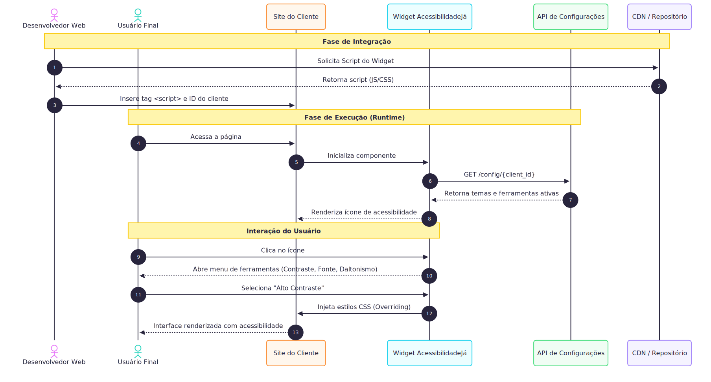

# 2.2. Módulo Notação UML – Modelagem Dinâmica

## Introdução

Para descrever como o sistema se comporta em tempo real e reage às ações do usuário, aplicamos a modelagem dinâmica da UML. Optamos por utilizar quatro dos principais diagramas: **Diagrama de Sequência**, **Diagrama de Atividades**, **Diagrama de Estados** e **Diagrama de Comunicação/Colaboração**.

## Metodologia

Para a realização das modelagens, nossa equipe da **AcessibilidadeJá** se dividiu em quatro grupos: Desse modo, todos conseguem colaborar.
A divisão foi feita da seguinte forma: Cada um dos quatro grupos deveria fazer um diagrama.

## Diagrama de Sequência 

O diagrama de sequência é a ferramenta da UML voltada para a modelagem do comportamento interativo do software. Ele descreve o ciclo de vida de uma operação, ordenando as mensagens enviadas e recebidas entre os objetos conforme o tempo passa. É o recurso ideal para validar a viabilidade técnica de um cenário de uso, garantindo que o fluxo de dados siga a lógica planejada.

### Justificativa da Escolha

Escolhemos o diagrama de sequência porque ele permite representar, de forma clara e cronológica, como as interações acontecem entre os atores e os componentes do sistema. Como a solução da AcessibilidadeJá envolve requisições do usuário, validações e respostas do sistema em uma ordem bem definida, esse tipo de diagrama facilita a visualização do fluxo completo da operação e evidencia possíveis pontos de dependência entre as etapas. Além disso, ele ajuda a validar se a lógica proposta é coerente antes da implementação, reduzindo ambiguidades e tornando a documentação mais fácil de entender para toda a equipe.

### Visão Estrutural

Versão interativa do diagrama no Mermaid: [abrir diagrama](https://mermaid.ai/d/fec3e752-08f8-4119-b2a5-f4a9bde5729c)

_Autoria: Lucas Branco & Matheus Rodrigues. Diagrama criado e renderizado via Mermaid._  

## Histórico de versões

| Versão | Data       | Descrição         | Autor(es)                                           |
| :----: | :--------- | :---------------- | :-------------------------------------------------- |
| `1.0`  | 14/04/2026 | Criação da página | [Felipe Brandim](https://github.com/Felipe-Brandim) |
| `1.1`  | 20/04/2026 | Apresentação da página e adição do Diagrama de Sequência | [Lucas Branco](https://github.com/lucasbbranco) |