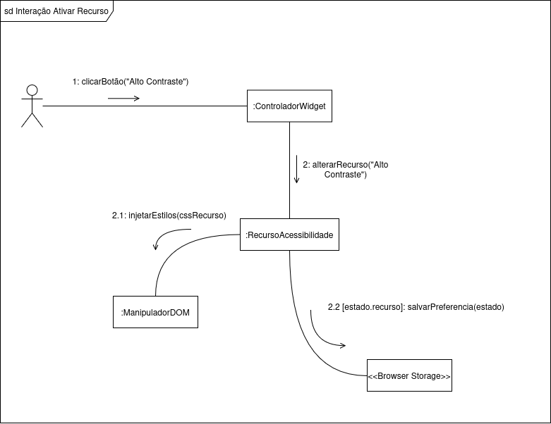
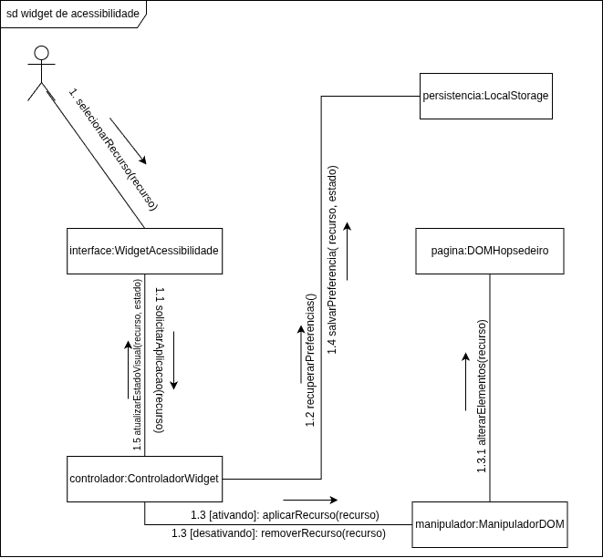

# 2.2. Módulo Notação UML – Modelagem Dinâmica

## Introdução

Para descrever como o sistema se comporta em tempo real e reage às ações do usuário, aplicamos a modelagem dinâmica da UML. Optamos por utilizar quatro dos principais diagramas: **Diagrama de Sequência**, **Diagrama de Atividades**, **Diagrama de Estados** e **Diagrama de Comunicação/Colaboração**.

## Metodologia

Para a realização das modelagens, nossa equipe da **AcessibilidadeJá** se dividiu em quatro grupos: Desse modo, todos conseguem colaborar.
A divisão foi feita da seguinte forma: Cada um dos quatro grupos deveria fazer um diagrama.

## Diagrama de Sequência

O diagrama de sequência é o artefato UML voltado para representar o comportamento interativo do sistema ao longo do tempo. Ele ordena cronologicamente as mensagens trocadas entre atores e componentes, tornando explícitas as dependências entre etapas e permitindo validar a viabilidade técnica de um fluxo antes mesmo da implementação.

### Justificativa da Escolha

A AcessibilidadeJá opera de forma integrada a sites de terceiros: o desenvolvedor incorpora o widget, o usuário final o acessa pelo navegador e o sistema responde às suas preferências em tempo real. Esse modelo de execução distribuída, com múltiplos participantes interagindo em sequência definida, é exatamente o cenário para o qual o diagrama de sequência foi projetado. Ele nos permitiu mapear o fluxo completo de uma sessão — desde a entrega do script até a aplicação dos estilos de acessibilidade no DOM — identificando dependências e possíveis pontos de falha antes do desenvolvimento.

### Fluxo Modelado

O diagrama representa o cenário de uso mais crítico do sistema: **a ativação de um recurso de acessibilidade pelo usuário final**. As interações seguem a ordem abaixo:

1. **Desenvolvedor → CDN/Servidor:** solicita o script do widget; o servidor retorna o arquivo JS/CSS.
2. **Desenvolvedor → Página:** insere a tag `<script>` com o ID de cliente na aplicação hospedeira.
3. **Usuário → Página:** acessa a página, que inicializa o componente do widget.
4. **Widget → API:** realiza `GET /config/{client_id}` para recuperar os temas e ferramentas habilitadas para aquele cliente.
5. **Widget → Usuário:** renderiza o ícone de acessibilidade na interface.
6. **Usuário → Widget:** clica no ícone, abrindo o menu de ferramentas (Contraste, Fonte, Daltonismo).
7. **Usuário → Widget:** seleciona "Alto Contraste".
8. **Widget → DOM:** injeta os estilos CSS com override no DOM do site hospedeiro.
9. **Resultado:** a interface é renderizada com as configurações de acessibilidade aplicadas.

### Visualização

Versão interativa do diagrama no Mermaid: [abrir diagrama](https://mermaid.ai/d/fec3e752-08f8-4119-b2a5-f4a9bde5729c)

_Autoria: Lucas Branco & Matheus Rodrigues. Diagrama criado e renderizado via Mermaid._  

## Diagrama de atividade

O diagrama de atividade é um modelo comportamental da UML que descreve processos e fluxos de trabalho de forma clara para alinhar as áreas de negócio e desenvolvimento. Utilizando símbolos específicos de início, fim e decisão, ele facilita a comunicação com os stakeholders ao simplificar casos de uso complexos. Seus principais benefícios incluem a demonstração da lógica de algoritmos, a modelagem de arquiteturas de software e a ilustração de interações entre usuários e o sistema. Assim, o diagrama atua como uma ferramenta essencial para organizar processos e melhorar a compreensão funcional do sistema.

[ link diagrama de atividades ](https://app.diagrams.net/?src=about)

_Autoria: Fernanda Vaz_

---

## Diagrama de Estados

Para complementar a visão estrutural do sistema, este artefato detalha o comportamento dinâmico e o ciclo de vida do `ControladorWidget`. Em cenários de injeção de código em domínios de terceiros (sites hospedeiros), o controle de estado rigoroso é vital para prevenir falhas críticas, como _race conditions_ e degradação de performance (_jank_).

Este mapeamento garante previsibilidade à ferramenta através de três pilares fundamentais:

- **Sincronismo de Inicialização:** O estado de **Aguardando DOM** blinda o script contra execuções prematuras, aguardando o gatilho nativo do navegador (`window.onload`) para garantir que a árvore do DOM esteja pronta para manipulação.
- **Persistência Reativa:** A lógica de decisão baseada em **Configurações Ativas** permite que o sistema recupere o estado de acessibilidade salvo anteriormente pelo usuário, restaurando a experiência de forma automática e transparente.
- **Segurança de Processamento:** O estado **Aplicando Mudança** delimita a janela de manipulação intensiva de estilos e elementos, assegurando que o sistema retorne a um estado de escuta estável (seja ele _Minimizado_ ou _Recurso Ativo_) apenas após a conclusão das tarefas do `ManipuladorDOM`.

---

### Visualização do Ciclo de Vida

_Autoria: Dara Maria e Felipe Brandim_

> _Nota: O diagrama formaliza as transições guiadas por eventos do sistema e interações diretas do usuário, garantindo que a interface (UI) e a lógica de acessibilidade operem em harmonia._

---

### Diagrama de Comunicação/Colaboração

O diagrama de comunicação é um modelo dinâmico da UML que representa as interações entre objetos ou componentes em um sistema. Ele destaca as mensagens trocadas e os relacionamentos entre os elementos, facilitando a compreensão do fluxo de comunicação e a identificação de dependências. No diagrama construído foi exemplificado a interação entre o `ControladorWidget` e o `ManipuladorDOM`, evidenciando a sequência de mensagens e a colaboração necessária para aplicar as mudanças de acessibilidade no DOM do site hospedeiro. No diagrama, optamos por exemplificar a ativação do recurso de alto contraste, mas a estrutura de comunicação se mantém consistente para os demais recursos.

 

##  Diagrama de Colaboração Generalista – Widget de AcessibilidadeJá

###  Visão Geral

Este diagrama de colaboração representa, de forma **abstrata e generalista**, como os principais componentes do sistema *AcessibilidadeJá* interagem para permitir a **ativação, desativação e persistência de recursos de acessibilidade**.

---

###  Participantes da Colaboração

- **Usuário**  
  Inicia a interação ao selecionar um recurso de acessibilidade.

- **Widget de Acessibilidade (Interface)**  
  Responsável por intermediar a comunicação entre o usuário e o sistema.

- **Controlador do Widget**  
  Coordena o fluxo de execução e gerencia as decisões sobre aplicação ou remoção de recursos.

- **Manipulador de DOM**  
  Executa as alterações visuais na interface da aplicação.

- **Página (DOM Hospedeiro)**  
  Ambiente onde os recursos de acessibilidade são aplicados.

- **Persistência (LocalStorage)**  
  Responsável por armazenar as preferências do usuário.

 
_Autoria: Enzo Fernandes_ e Fábio Araújo

## Histórico de versões

| Versão | Data       | Descrição                                            | Autor(es)                                                                                             |
| :----: | :--------- | :--------------------------------------------------- | :---------------------------------------------------------------------------------------------------- |
| `1.0`  | 14/04/2026 | Criação da página                                    | [Felipe Brandim](https://github.com/Felipe-Brandim)                                                   |
| `1.1`  | 20/04/2026 | Criação inicial do diagrama de atividades            | [Fernanda Vaz ](https://github.com/)                                                                  |
| `1.2`  | 21/04/2026 | Criação do diagrama de estados                       | [Dara Maria](https://github.com/daramariabs)   [Felipe Brandim](https://github.com/Felipe-Brandim) |
| `1.3`  | 21/04/2026 | Criação do diagrama de sequência e ajustes na página | [Lucas Branco](https://github.com/lucasbbranco)                                                       |
| `1.4`  | 21/04/2026 | Criação do diagrama de Colaboração                   | [Isaac Batista](https://github.com/isaacbatista26)                                                    |
| `1.5`  | 21/04/2026 | Criação do diagrama de Comunicação Generalista       | [Enzo Fernandes](https://github.com/enzo-fb)                                                          |
| `1.6`  | 21/04/2026 | Criação do texto do diagrama de Comunicação Generalista       | [Fábio Araújo](https://github.com/fabiofonteles1)                                                             |
| `1.7`  | 22/04/2026 | Reescrita e detalhamento do texto do diagrama de sequência    | [Matheus Rodrigues](https://github.com/mrodrigues14)                                                          |
