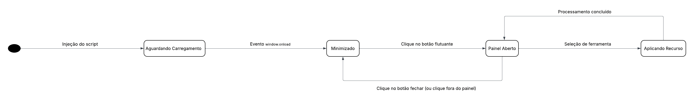

# 2.2. Módulo Notação UML – Modelagem Dinâmica

## Diagrama de Sequência

## Diagrama de atividade 

O diagrama de atividade é um modelo comportamental da UML que descreve processos e fluxos de trabalho de forma clara para alinhar as áreas de negócio e desenvolvimento. Utilizando símbolos específicos de início, fim e decisão, ele facilita a comunicação com os stakeholders ao simplificar casos de uso complexos. Seus principais benefícios incluem a demonstração da lógica de algoritmos, a modelagem de arquiteturas de software e a ilustração de interações entre usuários e o sistema. Assim, o diagrama atua como uma ferramenta essencial para organizar processos e melhorar a compreensão funcional do sistema.

[ link diagrama de atividades ](https://app.diagrams.net/?src=about)

*Autoria: Fernanda Vaz*

---

## Diagrama de Estados

Para complementar a visão estrutural do nosso sistema, este artefato detalha o comportamento dinâmico e o ciclo de vida da classe principal, o `ControladorWidget`. 

Em cenários de injeção de código em ambientes de terceiros (o site hospedeiro), a ausência de um controle de estado rigoroso pode resultar em falhas críticas, como *race conditions* ou degradação de performance (*jank*). O mapeamento a seguir formaliza as transições guiadas por eventos do navegador (como o `window.onload`) e interações diretas do usuário.

Este controle garante previsibilidade à ferramenta:
* **Prevenção de Falhas:** O estado de *Aguardando Carregamento* blinda o script contra execuções prematuras antes que a árvore do DOM esteja pronta.
* **Isolamento de UI:** A transição entre *Minimizado* e *Painel Aberto* assegura que o widget consuma recursos gráficos apenas quando ativamente solicitado.
* **Segurança de Processamento:** O estado *Aplicando Recurso* delimita a janela onde ocorre a manipulação pesada de estilos, garantindo que o sistema retorne a um estado de escuta estável após a conclusão.

*Autoria: Dara Maria e Felipe Brandim*

Baseado no primeiro diagrama de estados foi criado um segundo diagrama de Estados com todas as funcionalidades descritas e detalhadas. Cada ferramenta opera como uma máquina de estados ortogonal, alternando entre os estados Inativo e Ativo de forma independente, permitindo que múltiplos efeitos se sobreponham simultaneamente na página. As ferramentas simples (Filtro Claro/Escuro, Lupa e Modo Leitura) transitam diretamente para seu estado ativo ao receber ativarUso(), enquanto as ferramentas paramétricas (Tradutor, Alto Contraste, Ajuste de Fonte, Ajuste de Tamanho e Ajuste de Cursor) passam por um sub-estado de seleção antes de aplicar o efeito, recebendo um parâmetro como língua, tipo de contraste ou tipo de cursor. Todas as ferramentas retornam ao estado Inativo através do evento desativarUso(), restaurando a página ao seu estado anterior.

*Autoria: Pedro Cruz*

---

## Histórico de versões

| Versão | Data       | Descrição         | Autor(es)                                           |
| :----: | :--------- | :---------------- | :-------------------------------------------------- |
| `1.0`  | 14/04/2026 | Criação da página | [Felipe Brandim](https://github.com/Felipe-Brandim) |
| `1.1`  | 20/04/2026 | Criação inicial do diagrama de atividades | [Fernanda Vaz ](https://github.com/) |
| `1.2`  | 21/04/2026 | Criação do diagrama de estados | [Dara Maria](https://github.com/daramariabs)    [Felipe Brandim](https://github.com/Felipe-Brandim) |
| `1.3`  | 23/04/2026 | Criação do segundo diagrama de estados | [Pedro Cruz](https://github.com/pfc15) |

