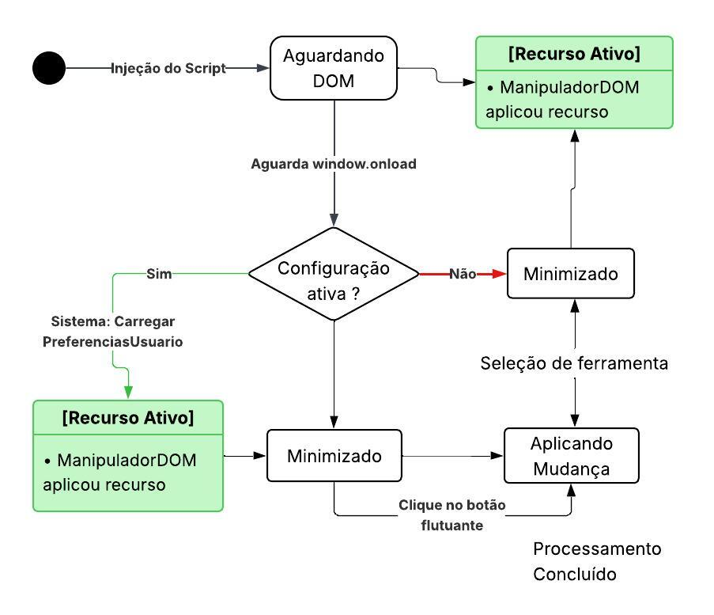

# 2.2. Módulo Notação UML – Modelagem Dinâmica

## Diagrama de Sequência

## Diagrama de atividade

O diagrama de atividade é um modelo comportamental da UML que descreve processos e fluxos de trabalho de forma clara para alinhar as áreas de negócio e desenvolvimento. Utilizando símbolos específicos de início, fim e decisão, ele facilita a comunicação com os stakeholders ao simplificar casos de uso complexos. Seus principais benefícios incluem a demonstração da lógica de algoritmos, a modelagem de arquiteturas de software e a ilustração de interações entre usuários e o sistema. Assim, o diagrama atua como uma ferramenta essencial para organizar processos e melhorar a compreensão funcional do sistema.

[ link diagrama de atividades ](https://app.diagrams.net/?src=about)

_Autoria: Fernanda Vaz_

---

## Diagrama de Estados

Para complementar a visão estrutural do sistema, este artefato detalha o comportamento dinâmico e o ciclo de vida do `ControladorWidget`. Em cenários de injeção de código em domínios de terceiros (sites hospedeiros), o controle de estado rigoroso é vital para prevenir falhas críticas, como _race conditions_ e degradação de performance (_jank_).

Este mapeamento garante previsibilidade à ferramenta através de três pilares fundamentais:

- **Sincronismo de Inicialização:** O estado de **Aguardando DOM** blinda o script contra execuções prematuras, aguardando o gatilho nativo do navegador (`window.onload`) para garantir que a árvore do DOM esteja pronta para manipulação.
- **Persistência Reativa:** A lógica de decisão baseada em **Configurações Ativas** permite que o sistema recupere o estado de acessibilidade salvo anteriormente pelo usuário, restaurando a experiência de forma automática e transparente.
- **Segurança de Processamento:** O estado **Aplicando Mudança** delimita a janela de manipulação intensiva de estilos e elementos, assegurando que o sistema retorne a um estado de escuta estável (seja ele _Minimizado_ ou _Recurso Ativo_) apenas após a conclusão das tarefas do `ManipuladorDOM`.

---

### Visualização do Ciclo de Vida

_Autoria: Dara Maria e Felipe Brandim_

> _Nota: O diagrama formaliza as transições guiadas por eventos do sistema e interações diretas do usuário, garantindo que a interface (UI) e a lógica de acessibilidade operem em harmonia._

---

## Histórico de versões

| Versão | Data       | Descrição                                 | Autor(es)                                                                                             |
| :----: | :--------- | :---------------------------------------- | :---------------------------------------------------------------------------------------------------- |
| `1.0`  | 14/04/2026 | Criação da página                         | [Felipe Brandim](https://github.com/Felipe-Brandim)                                                   |
| `1.1`  | 20/04/2026 | Criação inicial do diagrama de atividades | [Fernanda Vaz ](https://github.com/)                                                                  |
| `1.2`  | 21/04/2026 | Criação do diagrama de estados            | [Dara Maria](https://github.com/daramariabs)   [Felipe Brandim](https://github.com/Felipe-Brandim) |
