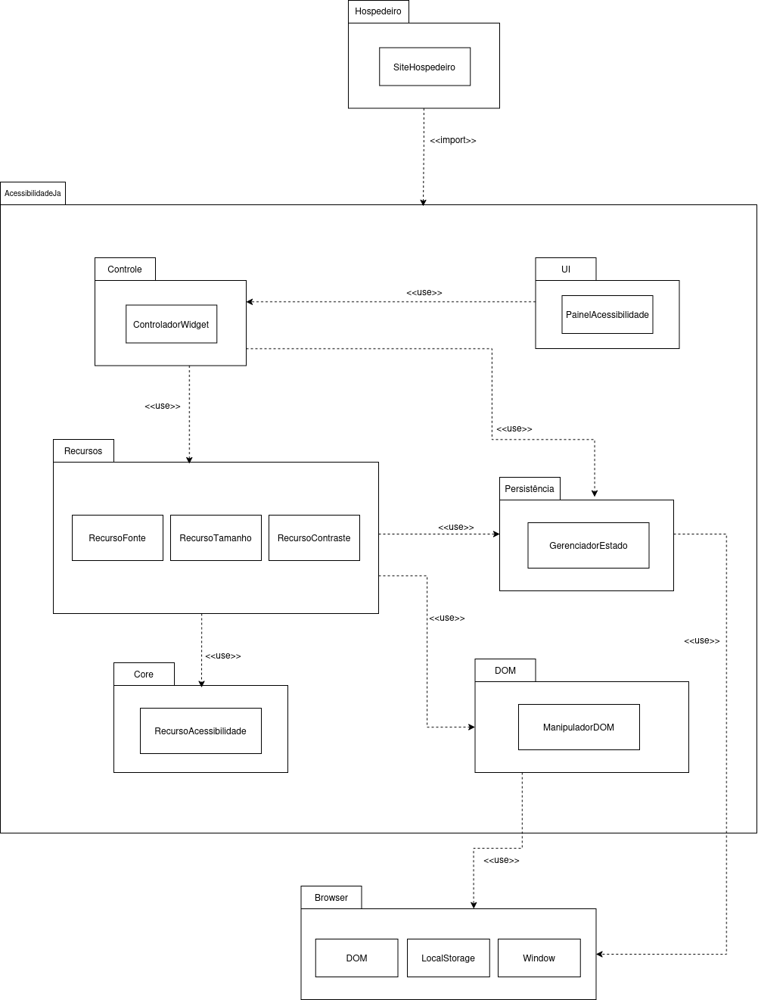
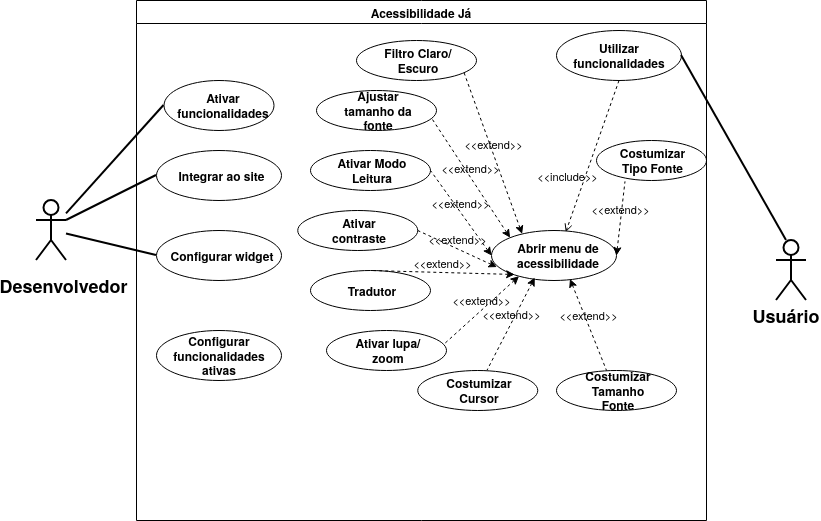

# 2.3. Módulo Notação UML – Modelagem Organizacional

## Introdução

Para descrever a organização estrutural do sistema e como seus componentes se relacionam em diferentes pacotes, aplicamos a modelagem organizacional da UML. Optamos pelo **Diagrama de Pacotes** e **Diagrama de Casos de Uso** como ferramenta principal para representar as dependências entre módulos e a arquitetura de alto nível da solução AcessibilidadeJá.

## Metodologia

Para a realização da modelagem organizacional, nossa equipe da **AcessibilidadeJá** trabalhou em colaboração para definir a estrutura de pacotes do sistema. A divisão de responsabilidades permitiu que cada membro pudesse contribuir com suas perspectivas sobre a organização arquitetural do projeto.

## Diagrama de Pacotes

O diagrama de pacotes é uma ferramenta da UML voltada para a modelagem da organização estrutural de um sistema. Ele representa como os elementos do sistema (classes, componentes, subsistemas) são agrupados em pacotes e como esses pacotes se relacionam e dependem uns dos outros. É o recurso ideal para visualizar a arquitetura de alto nível, estabelecer divisões lógicas e garantir que as dependências entre módulos sejam coerentes e bem definidas.

### Justificativa da Escolha

Escolhemos o diagrama de pacotes porque ele permite representar, de forma clara e visual, a organização modular do sistema AcessibilidadeJá. Como a solução envolve múltiplos componentes (frontend, backend, widget de acessibilidade, etc.), esse tipo de diagrama facilita a compreensão de como esses elementos se estruturam, quais as dependências entre eles e como se relacionam. Além disso, ajuda a validar a coesão arquitetural, reduzindo acoplamentos desnecessários e tornando mais fácil para novos desenvolvedores entender a estrutura geral do projeto.

### Visão Estrutural

Versão interativa do diagrama no Mermaid: [abrir diagrama](https://mermaid.ai/d/11c87e6c-24af-42f0-b615-8d24fb24e651)

_Autoria: Lucas Branco & Matheus Rodrigues_

---

_Autoria: Isaac Batista_

## Diagrama de casos de uso 

O diagrama de casos de uso representa as interações entre os atores — Desenvolvedor e Usuário — e o sistema Acessibilidade Já. O Desenvolvedor é responsável por configurar e integrar o widget ao site, enquanto o Usuário interage com as funcionalidades de acessibilidade disponíveis, como filtro claro/escuro, tradutor, lupa, ajuste de fonte e contraste. O caso de uso central Abrir menu de acessibilidade é estendido por praticamente todas as funcionalidades, evidenciando que o menu é o ponto de entrada obrigatório para o sistema. Diagramas de casos de uso são fundamentais no desenvolvimento de software pois permitem comunicar, de forma clara e independente de tecnologia, o que o sistema deve fazer e para quem — facilitando o alinhamento entre desenvolvedores, designers e partes interessadas antes mesmo de qualquer linha de código ser escrita. Eles também servem como base para a definição de requisitos funcionais e para a criação de cenários de teste.

### Diagrama de Casos de Uso

---

## Histórico de versões

| Versão | Data       | Descrição         | Autor(es)                                           |
| :----: | :--------- | :---------------- | :-------------------------------------------------- |
| `1.0`  | 14/04/2026 | Criação da página | [Felipe Brandim](https://github.com/Felipe-Brandim) |
| `1.1`  | 21/04/2026 | Adição do Diagrama de Pacotes e estruturação do módulo | [Lucas Branco](https://github.com/lucasbbranco) |
| `1.2`  | 21/04/2026 | Adição de outra versão do Diagrama de Pacotes | [Isaac Batista](https://github.com/isaacbatista26) |
| `1.3`  | 21/04/2026 | Criação INICIAL do diagrama de casos de uso | [Fernanda Vaz](https://github.com/Fernandavazgit1) |
| `1.3`  | 23/04/2026 | Completando o diagrama de casos de uso | [Pedro Cruz](https://github.com/pfc15) |
