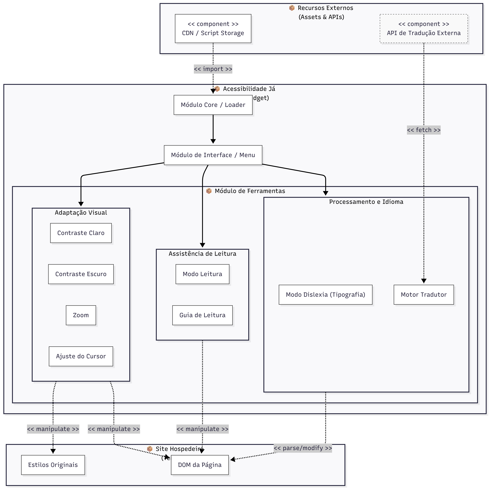
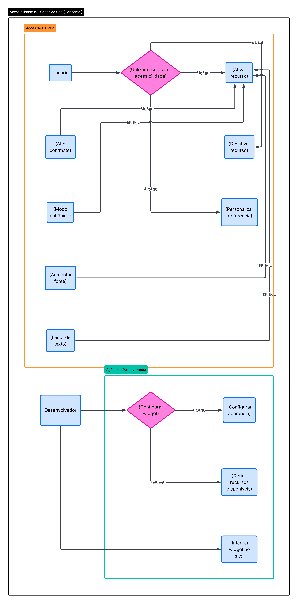

# 2.3. Módulo Notação UML – Modelagem Organizacional

## Introdução

Para descrever a organização estrutural do sistema e como seus componentes se relacionam em diferentes pacotes, aplicamos a modelagem organizacional da UML. Optamos pelo **Diagrama de Pacotes** e **Diagrama de Casos de Uso** como ferramenta principal para representar as dependências entre módulos e a arquitetura de alto nível da solução AcessibilidadeJá.

## Metodologia

Para a realização da modelagem organizacional, nossa equipe da **AcessibilidadeJá** trabalhou em colaboração para definir a estrutura de pacotes do sistema. A divisão de responsabilidades permitiu que cada membro pudesse contribuir com suas perspectivas sobre a organização arquitetural do projeto.

## Diagrama de Pacotes

O diagrama de pacotes é uma ferramenta da UML voltada para a modelagem da organização estrutural de um sistema. Ele representa como os elementos do sistema (classes, componentes, subsistemas) são agrupados em pacotes e como esses pacotes se relacionam e dependem uns dos outros. É o recurso ideal para visualizar a arquitetura de alto nível, estabelecer divisões lógicas e garantir que as dependências entre módulos sejam coerentes e bem definidas.

### Justificativa da Escolha

Escolhemos o diagrama de pacotes porque ele permite representar, de forma clara e visual, a organização modular do sistema AcessibilidadeJá. Como a solução envolve múltiplos componentes (frontend, backend, widget de acessibilidade, etc.), esse tipo de diagrama facilita a compreensão de como esses elementos se estruturam, quais as dependências entre eles e como se relacionam. Além disso, ajuda a validar a coesão arquitetural, reduzindo acoplamentos desnecessários e tornando mais fácil para novos desenvolvedores entender a estrutura geral do projeto.

### Visão Estrutural

<!-- Versão interativa do diagrama no Mermaid (Primeira versão do diagrama): [abrir diagrama](https://mermaid.ai/d/11c87e6c-24af-42f0-b615-8d24fb24e651)-->
Versão interativa do diagrama no Mermaid: [abrir diagrama](https://mermaid.ai/d/54b71df9-3bd2-4532-949e-a08eefc734b7)

_Autoria: Lucas Branco & Matheus Rodrigues,
       Dara Maria & Felipe Brandim_

---

_Autoria: Isaac Batista_

### Descrição dos Pacotes

O sistema AcessibilidadeJá é organizado em dois contextos externos — **Hospedeiro** e **Browser** — e um núcleo interno, o pacote **AcessibilidadeJá**, que concentra toda a lógica do widget.

#### Pacote `Hospedeiro`

Representa o site de terceiro que adota a ferramenta. O elemento `SiteHospedeiro` realiza uma dependência `<<import>>` sobre o pacote `AcessibilidadeJá`, indicando que a integração é feita por importação do bundle publicado — sem qualquer acoplamento com a implementação interna do widget. Esse isolamento é intencional: o site hospedeiro conhece apenas a interface pública do widget, e não seus módulos internos.

#### Pacote `AcessibilidadeJá`

É o pacote raiz da solução. Ele agrupa seis subpacotes com responsabilidades bem definidas:

| Subpacote      | Elemento principal                                   | Responsabilidade                                                                                |
| -------------- | ---------------------------------------------------- | ----------------------------------------------------------------------------------------------- |
| `Controle`     | `ControladorWidget`                                  | Orquestra a ativação/desativação de recursos, delega ações e coordena os demais pacotes         |
| `UI`           | `PainelAcessibilidade`                               | Renderiza a interface visível ao usuário (botões, painel flutuante)                             |
| `Recursos`     | `RecursoFonte`, `RecursoTamanho`, `RecursoContraste` | Encapsula cada funcionalidade de acessibilidade como unidade independente                       |
| `Core`         | `RecursoAcessibilidade`                              | Define a classe abstrata base da qual todos os recursos herdam                                  |
| `Persistência` | `GerenciadorEstado`                                  | Salva e recupera preferências do usuário entre sessões                                          |
| `DOM`          | `ManipuladorDOM`                                     | Concentra todas as manipulações do DOM e injeções de estilo, preservando o isolamento do widget |

#### Relações entre subpacotes

As dependências internas seguem o estereótipo `<<use>>`, que indica que um pacote utiliza serviços de outro sem criar acoplamento estrutural:

- `UI` (`PainelAcessibilidade`) `<<use>>` `Controle` (`ControladorWidget`) — a interface delega ao controlador toda ação disparada pelo usuário.
- `Controle` `<<use>>` `Recursos` — o controlador aciona os recursos de acessibilidade conforme a interação.
- `Recursos` `<<use>>` `Core` — cada recurso concreto especializa a classe abstrata `RecursoAcessibilidade`.
- `Recursos` `<<use>>` `Persistência` — os recursos consultam e atualizam o estado persistido.
- `UI` `<<use>>` `Persistência` — o painel lê o estado salvo para refletir as preferências ativas ao ser renderizado.
- `Persistência` `<<use>>` `DOM` — o gerenciador de estado aciona o manipulador DOM para aplicar as preferências recuperadas.
- `DOM` `<<use>>` `Browser` — o `ManipuladorDOM` interage com as APIs nativas do navegador (`DOM`, `LocalStorage`, `Window`).

#### Pacote `Browser`

Representa o ambiente de execução nativo do navegador. Expõe três elementos consumidos pelo widget:

- **DOM** — API para leitura e manipulação da árvore de elementos da página.
- **LocalStorage** — mecanismo de persistência client-side, utilizado para salvar preferências entre sessões sem necessidade de backend.
- **Window** — objeto global do navegador, utilizado para escuta de eventos e controle de ciclo de vida.

#### Síntese arquitetural

A organização em pacotes reforça as principais decisões de projeto do AcessibilidadeJá:

- **Isolamento**: o site hospedeiro nunca acessa os subpacotes internos diretamente, apenas importa o ponto de entrada público.
- **Coesão**: cada subpacote possui uma única responsabilidade bem definida.
- **Extensibilidade**: novos recursos de acessibilidade são adicionados como especializações de `Core::RecursoAcessibilidade`, sem alterar `Controle`, `UI` ou `Persistência`.
- **Independência de backend**: toda a execução ocorre no `Browser`, dispensando infraestrutura própria após a distribuição do pacote npm.

---

## Diagrama de casos de uso

O diagrama de casos de uso representa as interações entre os atores — Desenvolvedor e Usuário — e o sistema Acessibilidade Já. O Desenvolvedor é responsável por configurar e integrar o widget ao site, enquanto o Usuário interage com as funcionalidades de acessibilidade disponíveis, como filtro claro/escuro, tradutor, lupa, ajuste de fonte e contraste. O caso de uso central Abrir menu de acessibilidade é estendido por praticamente todas as funcionalidades, evidenciando que o menu é o ponto de entrada obrigatório para o sistema. Diagramas de casos de uso são fundamentais no desenvolvimento de software pois permitem comunicar, de forma clara e independente de tecnologia, o que o sistema deve fazer e para quem — facilitando o alinhamento entre desenvolvedores, designers e partes interessadas antes mesmo de qualquer linha de código ser escrita. Eles também servem como base para a definição de requisitos funcionais e para a criação de cenários de teste.

### Diagrama de Casos de Uso

---

### Diagrama com melhorias

## Histórico de versões

| Versão  | Data       | Descrição                                                                     | Autor(es)                                            |
| :-----: | :--------- | :---------------------------------------------------------------------------- | :--------------------------------------------------- |
|  `1.0`  | 14/04/2026 | Criação da página                                                             | [Felipe Brandim](https://github.com/Felipe-Brandim)  |
|  `1.1`  | 21/04/2026 | Adição do Diagrama de Pacotes e estruturação do módulo                        | [Lucas Branco](https://github.com/lucasbbranco)      |
|  `1.2`  | 21/04/2026 | Adição de outra versão do Diagrama de Pacotes                                 | [Isaac Batista](https://github.com/isaacbatista26)   |
|  `1.3`  | 21/04/2026 | Criação INICIAL do diagrama de casos de uso                                   | [Fernanda Vaz](https://github.com/Fernandavazgit1)   |
| `1.4` | 21/04/2026 | Prosseguimento na confecção do diagrama de casos de uso                       | [Enzo Fernandes](https://github.com/enzo-fb)         |
|  `1.5`  | 23/04/2026 | Versão com melhorias do diagrama de casos de uso                              | [Fábio Araújo](https://github.com/fabiofonteles1)    |
|  `1.6`  | 23/04/2026 | Descrição detalhada dos pacotes (subpacotes, relações e síntese arquitetural) | [Matheus Rodrigues](https://github.com/mrodrigues14) |
|  `1.7`  | 23/04/2026 | Versão com melhorias do diagrama de casos de uso                              | [Fábio Araújo](https://github.com/fabiofonteles1)    |
|  `1.8`  | 23/04/2026 | Completando o diagrama de casos de uso                                        | [Pedro Cruz](https://github.com/pfc15)               |
|  `1.9`  | 23/04/2026 | Refatoração diagrama de pacotes com as novas ferramentas de acessibilidade                                        | [Dara Maria](https://github.com/daramariabs)       [Felipe Brandim](https://github.com/Felipe-Brandim)         |