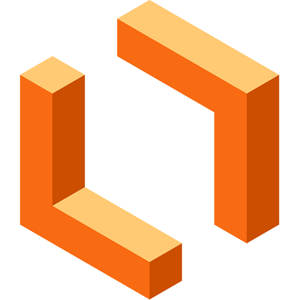

# 2.5. Iniciativas Extras (Modelagem)

 Ferramentas Utilizadas

## Introdução

Diversas ferramentas foram utilizadas para o desenvolvimento dessa etapa do projeto da disciplina, e sua documentação se faz importante para facilitar a manutenção, garantir a reprodutibildiade e melhorar esta própria documentação.
Na **Tabela** abaixo, são listadas as ferramentas que nos auxiliaram nesse processo da segunda entrega, referente à etapa de **Modelagem**.

<b>Tabela 1:</b> Ferramentas Utilizadas - Modelagem

| Logo | Ferramenta | Finalidade |
| :-----: | :----: | ----------- |
|  | [GitHub](https://github.com/) | Plataforma online utilizada pra gerenciar o versionamento e o armazenamento dos documentos produzidos e hospedar a aplicação da documentação. |
|   | [Git](https://git-scm.com/) | Aplicação local utilizada pra gerenciar o versionamento da documentação. |
|       | [Visual Studio Code](https://code.visualstudio.com/) | IDE utilizada para edição de código dos arquivos da documentação. |
|        | [WhatsApp](https://www.whatsapp.com/) | Plataforma utilizada para a comunicação rápida e pontual do grupo. |
|         | [Canva](https://www.canva.com/) | Ferramenta utilizada para a produção de alguns Diagramas de Sequência. |
|    | [Lucidchart](https://lucid.app/documents#/documents?folder_id=shared) | Ferramenta utilizada para a construção dos diagramas de Classes, Atividades, Caso de Uso e Pacotes. |
|    | [Mermaid Live Editor](https://mermaid.js.org/) | Ferramenta utilizada para a construção de alguns Diagramas de Sequência. |
|     | [Youtube](https://www.youtube.com/) | Plataforma utilizada para hospedar e disponibilizar os vídeos das gravações das reuniões. |

---

## Bibliografia

> GitHub. Disponível em: https://github.com/. Acesso em: 12 de abril de 2026.  
> 
> Git. Disponível em: https://git-scm.com/. Acesso em: 12 de abril de 2026.   
> 
> Visual Studio Code. Disponível em: https://code.visualstudio.com/. Acesso em: 12 de abril de 2026.    
> 
> WhatsApp. Disponível em: https://www.whatsapp.com/. Acesso em: 12 de abril de 2026.    
> 
> Canva. Disponível em: https://www.canva.com/. Acesso em: 12 de abril de 2026.    
> 
> YouTube. Disponível em: https://www.youtube.com/. Acesso em: 12 de abril de 2026.      
> 
> Lucidchart. Disponível em: https://lucid.app/documents#/documents?folder_id=shared. Acesso em: 12 de abril de 2026.    
> 
> Mermaid Live Editor. Disponível em: https://mermaid.js.org/. Acesso em: 12 de abril de 2026.    

    
 

## Histórico de versões

| Versão | Data       | Descrição         | Autor(es)                                           |
| :----: | :--------- | :---------------- | :-------------------------------------------------- |
| `1.0`  | 14/04/2026 | Criação da página | [Felipe Brandim](https://github.com/Felipe-Brandim) |
| `1.1`  | 23/04/2026 | Ferramentas Utilizadas | [Fábio Araújo](https://github.com/fabiofonteles1) |